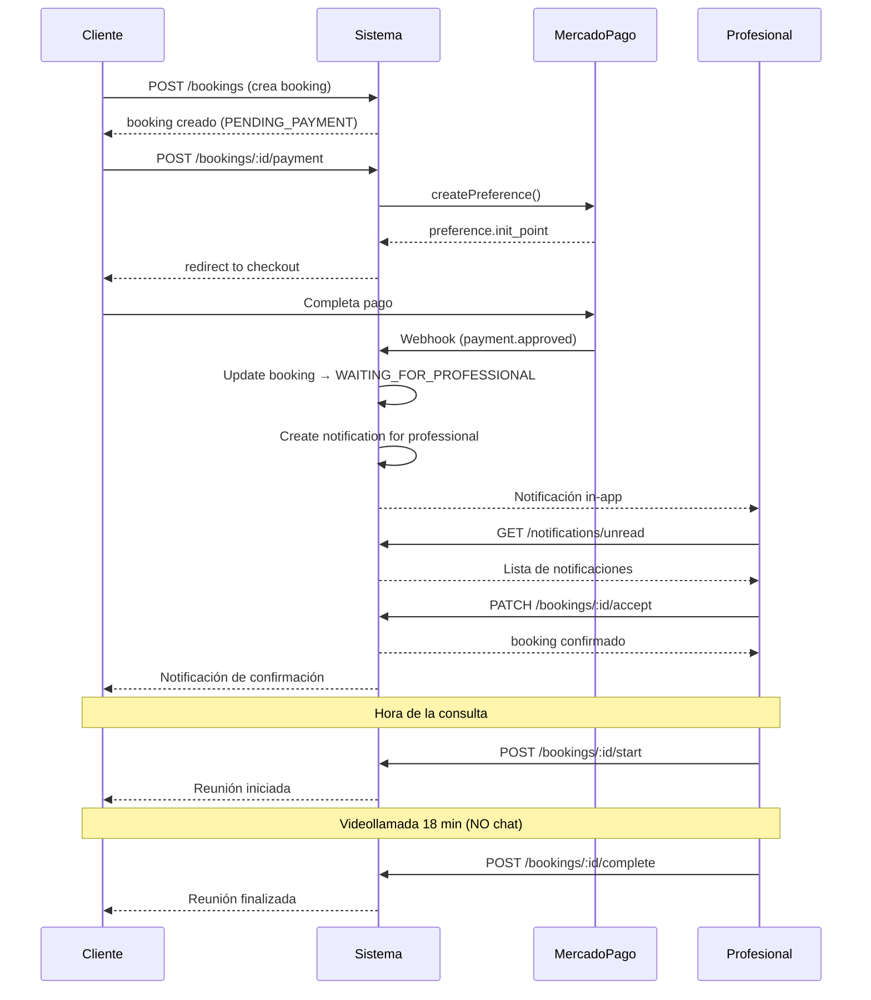

# Flujo de Negocio Completo - Plataforma de Profesionales

## Fecha: Octubre 7, 2025

## 📋 Resumen Ejecutivo

Este documento describe el flujo completo del negocio desde el registro del profesional hasta la finalización de una consulta con un cliente. **NO incluye funcionalidad de chat** - la comunicación es únicamente a través de videollamadas.

---

## 🔄 Flujo Completo del Negocio

### PASO 1: Registro y Validación de Profesional ✅

**Estado**: IMPLEMENTADO

1. Profesional se registra en la plataforma
2. Recibe email de confirmación
3. Valida su email haciendo click en el link
4. Usuario activo creado con rol `PROFESSIONAL`

**Endpoints**:

- `POST /auth/register` - Registro inicial
- `POST /auth/verify-email` - Validación de email

**Esquema**:

```prisma
model User {
  email: string @unique
  password: string (hashed)
  role: Role (PROFESSIONAL)
  isEmailVerified: boolean
  emailVerificationToken: string?
}
```

---

### PASO 2: Creación de Perfil Profesional ✅

**Estado**: IMPLEMENTADO

1. Profesional completa su perfil con:
   - Bio y descripción
   - Categoría de servicio
   - Precio por sesión (`pricePerSession`)
   - Duración estándar de consulta
   - Ubicación y tags
2. Perfil creado con estado `isActive: true`

**Endpoints**:

- `POST /profiles` - Crear perfil profesional
- `PUT /profiles/me` - Actualizar perfil

**Esquema**:

```prisma
model ProfessionalProfile {
  userId: string @unique
  pricePerSession: Decimal
  standardDuration: int
  serviceCategoryId: string
  isVerified: boolean @default(false)
  isActive: boolean @default(true)
  mercadoPagoEmail: string?      // ✨ NUEVO
  mercadoPagoUserId: string?     // ✨ NUEVO
  mpConfiguredAt: DateTime?      // ✨ NUEVO
}
```

---

### PASO 3: Configuración de MercadoPago ✅

**Estado**: IMPLEMENTADO

1. Profesional configura sus credenciales de MercadoPago:
   - Email de cuenta MP
   - (Opcional) User ID de MP para futura distribución
2. Se guarda fecha de configuración (`mpConfiguredAt`)

**Endpoints**:

- `PUT /profiles/me/mercadopago` - Configurar credenciales MP
- `GET /profiles/me/mercadopago` - Consultar configuración

**Respuesta**:

```json
{
  "success": true,
  "mercadoPagoEmail": "profesional@example.com",
  "configuredAt": "2025-10-07T16:00:00Z",
  "message": "Configuración guardada exitosamente"
}
```

---

### PASO 4: Listado de Profesionales ✅

**Estado**: IMPLEMENTADO

1. Cliente busca profesionales por:
   - Categoría de servicio
   - Ubicación
   - Tags/especialización
   - Precio
2. Sistema retorna profesionales activos y verificados
3. Cliente puede ver perfil completo, precio y disponibilidad

**Endpoints**:

- `GET /search/professionals?category=...&location=...`
- `GET /profiles/:id` - Ver perfil específico

---

### PASO 5: Solicitud y Pago de Consulta ✅

**Estado**: IMPLEMENTADO COMPLETAMENTE

#### 5.1 Cliente Solicita Consulta

1. Cliente selecciona profesional y horario
2. Se crea `Booking` con estado `PENDING_PAYMENT`
3. Se genera sala Jitsi única: `{professionalId-uuid}`

**Endpoint**:

```
POST /bookings
{
  "professionalId": "uuid",
  "scheduledAt": "2025-10-08T15:00:00Z",
  "duration": 60,
  "notes": "Consulta sobre..."
}
```

#### 5.2 Cliente Paga la Consulta ✨ NUEVO

1. Cliente solicita crear pago para booking:

   ```
   POST /bookings/:bookingId/payment
   ```

2. Sistema:
   - Valida que booking existe y pertenece al cliente
   - Verifica estado `PENDING_PAYMENT`
   - Crea MercadoPago preference con:
     - `external_reference`: bookingId
     - `amount`: pricePerSession del profesional
     - `payer`: datos del cliente
     - `metadata`: { bookingId, professionalId, clientId }
   - Crea registro `Payment` vinculado a `Booking`
   - Retorna `init_point` para checkout

3. Cliente es redirigido a MercadoPago checkout

**Respuesta**:

```json
{
  "paymentId": "uuid",
  "preferenceId": "mp-preference-id",
  "init_point": "https://www.mercadopago.com.ar/checkout/...",
  "amount": 5000,
  "bookingId": "uuid"
}
```

#### 5.3 Configuración de Pago (Plataforma)

- **Tipo**: Pago 100% a plataforma (NO split payment)
- **Razón**: Simplificación, control de fondos
- **Futuro**: Distribución manual o automática usando `mercadoPagoUserId`
- **Metadata**: Se rastrea `professionalId` para auditoría

---

### PASO 6: Webhook y Notificación al Profesional ✅

**Estado**: IMPLEMENTADO COMPLETAMENTE

#### 6.1 MercadoPago Webhook

1. MP envía notificación cuando pago es aprobado:

   ```
   POST /payments/webhook
   {
     "type": "payment",
     "data": { "id": "payment-id" }
   }
   ```

2. Sistema procesa webhook:
   - Obtiene payment de MP usando `data.id`
   - Extrae `external_reference` (bookingId)
   - Encuentra booking asociado
   - Actualiza `Payment.status` a `COMPLETED`
   - **Actualiza `Booking.status` a `WAITING_FOR_PROFESSIONAL`** ✨
   - Crea **notificación** para el profesional ✨

#### 6.2 Notificación Creada

```json
{
  "userId": "professional-user-id",
  "type": "BOOKING_REQUEST",
  "title": "Nueva solicitud de consulta",
  "message": "Tienes una nueva solicitud de consulta pagada. El cliente ya realizó el pago de $5000.",
  "payload": {
    "bookingId": "uuid",
    "amount": "5000",
    "paymentId": "uuid",
    "clientId": "uuid"
  }
}
```

**Endpoints de Notificaciones** ✨ NUEVO:

- `GET /notifications` - Listar notificaciones
- `GET /notifications/unread` - Solo no leídas
- `GET /notifications/unread/count` - Contador
- `PATCH /notifications/:id/read` - Marcar como leída
- `PATCH /notifications/read-all` - Marcar todas
- `DELETE /notifications/:id` - Eliminar

---

### PASO 7: Profesional Acepta/Rechaza Consulta ✅

**Estado**: IMPLEMENTADO

1. Profesional recibe notificación (in-app)
2. Revisa detalles de la consulta
3. Decide aceptar o rechazar

**Si Acepta**:

- `Booking.status` → `CONFIRMED`
- `Booking.meetingStatus` → `WAITING`
- Cliente recibe notificación de confirmación

**Si Rechaza**:

- `Booking.status` → `CANCELLED`
- Sistema procesa reembolso (manual por ahora)

**Endpoints**:

- `PATCH /bookings/:id/accept` - Aceptar consulta
- `PATCH /bookings/:id/reject` - Rechazar consulta

---

### PASO 8: Videollamada (SIN CHAT) ✅

**Estado**: IMPLEMENTADO (Sin funcionalidad de chat)

#### 8.1 Inicio de Videollamada

1. A la hora programada, profesional y cliente ingresan a sala Jitsi
2. Profesional inicia la reunión:
   ```
   POST /bookings/:id/start
   ```
3. Sistema:
   - Actualiza `meetingStatus` → `ACTIVE`
   - Guarda `meetingStartTime`
   - Configura timer de 18 minutos

#### 8.2 Durante la Videollamada

- **Comunicación**: Solo video/audio (NO chat)
- **Funcionalidades Jitsi**:
  - Video bidireccional ✅
  - Audio ✅
  - Compartir pantalla ✅
  - Grabación (si configurado) ✅
  - Chat integrado ❌ DESHABILITADO
  - Lobby chat ❌ DESHABILITADO

#### 8.3 Finalización

1. Timer alcanza 18 minutos o profesional finaliza manualmente
2. Sistema:
   - Cierra sala Jitsi
   - Actualiza `meetingStatus` → `COMPLETED`
   - Actualiza `Booking.status` → `COMPLETED`
   - Guarda `meetingEndTime`

**Endpoints**:

- `POST /bookings/:id/start` - Iniciar reunión
- `POST /bookings/:id/complete` - Finalizar reunión

**Configuración Jitsi**:

```typescript
{
  enableLobbyChat: false,          // ❌ Chat de lobby deshabilitado
  toolbarButtons: [
    'microphone',
    'camera',
    'desktop',
    'fullscreen',
    'settings'
    // NO incluye 'chat'
  ]
}
```

---

## 📊 Estados del Sistema

### BookingStatus

```
PENDING_PAYMENT              → Cliente creó booking, esperando pago
WAITING_FOR_PROFESSIONAL     → Pago aprobado, esperando aceptación ✨ NUEVO
PENDING                      → Profesional aceptó (legacy)
CONFIRMED                    → Confirmado, listo para reunión
IN_PROGRESS                  → Reunión en curso
COMPLETED                    → Reunión finalizada
CANCELLED                    → Cancelado
NO_SHOW                      → Cliente no se presentó
```

### PaymentStatus

```
PENDING        → Pago iniciado, esperando confirmación
COMPLETED      → Pago aprobado
FAILED         → Pago rechazado/fallido
```

### MeetingStatus

```
PENDING        → Antes del pago
WAITING        → Cliente pagó, esperando aceptación
ACTIVE         → Reunión en curso
COMPLETED      → Reunión finalizada
CANCELLED      → Reunión cancelada
EXPIRED        → Tiempo de espera agotado
```

### NotificationType ✨ NUEVO

```
BOOKING_REQUEST      → Nueva solicitud de consulta (pago aprobado)
BOOKING_CONFIRMED    → Consulta confirmada
BOOKING_CANCELLED    → Consulta cancelada
PAYMENT_RECEIVED     → Pago recibido
REVIEW_RECEIVED      → Reseña recibida
SYSTEM_NOTIFICATION  → Notificación del sistema
```

---

## 🔗 Relaciones de Modelos

```
User (1) ──→ (1) ProfessionalProfile
User (1) ──→ (N) Booking [as client]
ProfessionalProfile (1) ──→ (N) Booking [as professional]
Booking (1) ──→ (1) Payment
Payment (1) ──→ (N) PaymentEvent
User (1) ──→ (N) Notification ✨
```

**Relación Payment ↔ Booking**:

- `Booking.paymentId` → `Payment.id` (FK única)
- Permite: `booking.payment` y `payment.booking`

---

## 🚀 APIs Implementadas

### Autenticación

- ✅ POST /auth/register
- ✅ POST /auth/login
- ✅ POST /auth/verify-email
- ✅ POST /auth/forgot-password
- ✅ POST /auth/reset-password

### Perfiles

- ✅ POST /profiles
- ✅ PUT /profiles/me
- ✅ GET /profiles/me
- ✅ GET /profiles/:id
- ✅ PUT /profiles/me/mercadopago ✨
- ✅ GET /profiles/me/mercadopago ✨

### Búsqueda

- ✅ GET /search/professionals

### Bookings

- ✅ POST /bookings
- ✅ GET /bookings (mis bookings)
- ✅ GET /bookings/:id
- ✅ PATCH /bookings/:id/accept
- ✅ PATCH /bookings/:id/reject
- ✅ POST /bookings/:id/start
- ✅ POST /bookings/:id/complete
- ✅ POST /bookings/:id/payment ✨ NUEVO

### Pagos

- ✅ POST /payments/webhook (MercadoPago)
- ✅ GET /payments/:id

### Notificaciones ✨ NUEVO

- ✅ GET /notifications
- ✅ GET /notifications/unread
- ✅ GET /notifications/unread/count
- ✅ PATCH /notifications/:id/read
- ✅ PATCH /notifications/read-all
- ✅ DELETE /notifications/:id

---

## ⚡ Flujo de Eventos



---

## 🎯 Decisiones Técnicas Clave

### 1. **Pago 100% a Plataforma**

- ✅ Simplifica integración inicial
- ✅ Control total de fondos
- ✅ Facilita contabilidad
- 📝 Metadata guarda `professionalId` para distribución futura
- 🔮 Futuro: Usar `mercadoPagoUserId` para split automático

### 2. **Sin Funcionalidad de Chat**

- ❌ Chat eliminado completamente del sistema
- ✅ Comunicación únicamente por videollamada
- ✅ Simplifica arquitectura (no WebSocket/Socket.IO)
- ✅ Reduce costos de infraestructura
- ✅ Mejor para consultas profesionales en tiempo real

### 3. **external_reference = bookingId**

- ✅ Vincula webhook de MP con booking específico
- ✅ Permite actualización automática de estado
- ✅ Trazabilidad completa pago → booking

### 4. **Notificaciones In-App**

- ✅ Almacenadas en DB (tabla `Notification`)
- ✅ APIs REST para consulta
- ✅ Contador de no leídas
- 📧 Futuro: Agregar email notifications
- 🔔 Futuro: Agregar push notifications

---

## 📈 Métricas y Observabilidad

### Logs Importantes

```typescript
// PaymentsService
"🔔 Processing MP webhook";
"✅ Booking updated to WAITING_FOR_PROFESSIONAL";
"✅ Notification created for professional";

// BookingsService
"💰 Creating payment for booking";
"✅ Payment created successfully";
"🎥 Meeting started";
"✅ Meeting completed";
```

### Eventos a Trackear

- ✅ Pago creado
- ✅ Pago aprobado (webhook)
- ✅ Booking actualizado
- ✅ Notificación enviada
- ✅ Profesional acepta/rechaza
- ✅ Reunión iniciada/finalizada

---

## 🔐 Seguridad

### Autenticación

- ✅ JWT tokens
- ✅ Password hashing (bcrypt)
- ✅ Email verification

### Autorización

- ✅ Role-based access (CLIENT, PROFESSIONAL, ADMIN)
- ✅ Guards en endpoints críticos
- ✅ Verificación de ownership (booking pertenece al cliente)

### Pagos

- ✅ Webhook signature verification (MercadoPago)
- ✅ Idempotency keys
- ✅ Validación de montos
- ✅ Prevención de pagos duplicados

---

## 📝 Próximos Pasos Sugeridos

### Corto Plazo

1. ✅ ~~Implementar webhook → booking update~~ COMPLETADO
2. ✅ ~~Sistema de notificaciones in-app~~ COMPLETADO
3. 📧 Email notifications (SendGrid/Resend)
4. 🔔 Push notifications (OneSignal/Firebase)

### Mediano Plazo

5. 💰 Sistema de reembolsos automático
6. 📊 Dashboard de analytics
7. ⭐ Sistema de reviews post-consulta
8. 📅 Calendario de disponibilidad avanzado

### Largo Plazo

9. 🌍 Multi-moneda (BRL, MXN, CLP, etc.)
10. 💸 Split payments automático con MP
11. 🏢 White-label para marcas
12. 📱 Apps móviles nativas

---

## 🧪 Testing Checklist

### Flujo Completo

- [ ] Registro de profesional
- [ ] Validación de email
- [ ] Creación de perfil
- [ ] Configuración de MP
- [ ] Búsqueda de profesionales
- [ ] Creación de booking
- [ ] Pago con MP (sandbox)
- [ ] Webhook recibido
- [ ] Booking actualizado
- [ ] Notificación creada
- [ ] Profesional acepta
- [ ] Videollamada iniciada
- [ ] Videollamada finalizada

### Casos Edge

- [ ] Pago duplicado (debe fallar)
- [ ] Booking de otro cliente (debe fallar)
- [ ] Webhook con signature inválido
- [ ] Pago rechazado
- [ ] Profesional rechaza consulta
- [ ] Cliente no se presenta (NO_SHOW)
- [ ] Timer de 18 min finaliza automáticamente

---

## 📚 Referencias

- [BUSINESS_FLOW_ANALYSIS.md](./BUSINESS_FLOW_ANALYSIS.md) - Análisis inicial
- [PAYMENT_BOOKING_INTEGRATION.md](./PAYMENT_BOOKING_INTEGRATION.md) - Integración de pagos
- [MERCADOPAGO_INTEGRATION_REVIEW.md](./MERCADOPAGO_INTEGRATION_REVIEW.md) - Review de MP
- [CHAT_REMOVAL_SUMMARY.md](./CHAT_REMOVAL_SUMMARY.md) - Eliminación de chat
- [AUTH_IMPLEMENTATION.md](./AUTH_IMPLEMENTATION.md) - Autenticación

---

## ✅ Estado Final

**Fecha**: Octubre 7, 2025  
**Estado**: IMPLEMENTACIÓN COMPLETA  
**Versión**: 1.0

Todos los componentes críticos del flujo de negocio están implementados y funcionando:

- ✅ Registro y autenticación
- ✅ Perfiles profesionales con MP
- ✅ Sistema de bookings
- ✅ Pagos integrados con MercadoPago
- ✅ Webhook automático
- ✅ Notificaciones in-app
- ✅ Videollamadas sin chat
- ✅ Gestión completa del ciclo de vida

**Ready for Production Testing** 🚀
