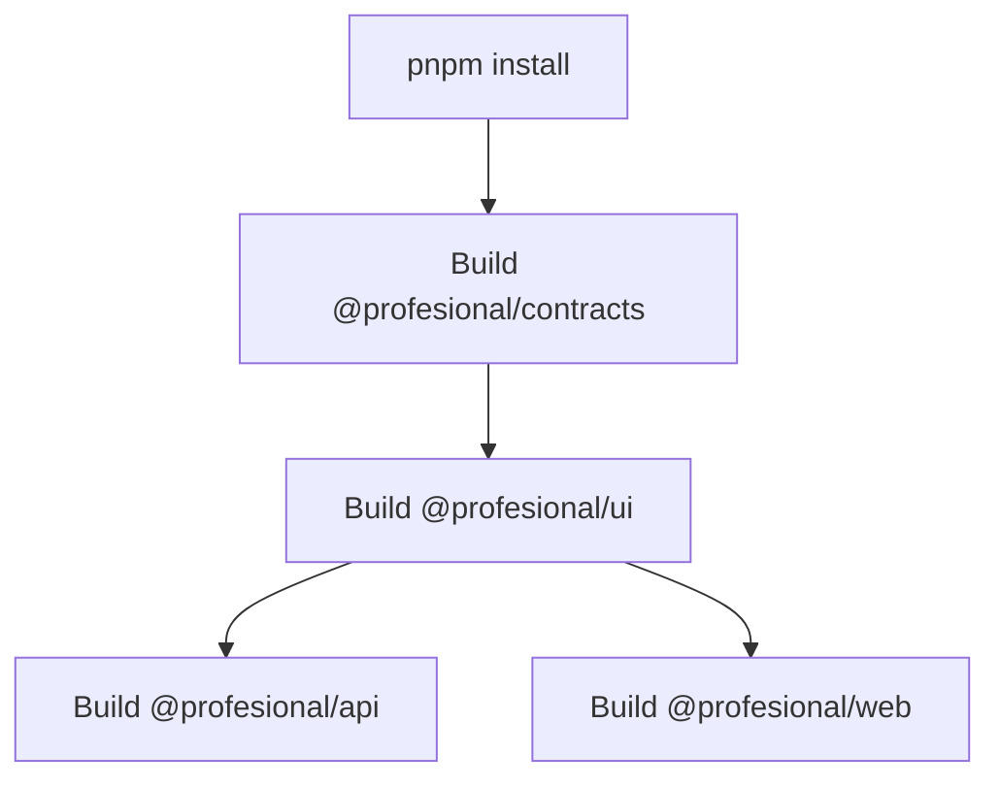

# Railway Build Configuration - Fixed

## 🐛 Problemas Encontrados

### 1. Error: Cannot find module '@profesional/contracts'

```
src/auth/auth.controller.ts:19:8 - error TS2307:
Cannot find module '@profesional/contracts' or its corresponding type declarations.
```

**Causa:**

- Railway estaba ejecutando `pnpm --filter @profesional/api build` directamente
- El paquete `@profesional/contracts` no se buildaba antes
- TypeScript no encontraba los tipos compilados

### 2. Error: Cannot find module '@profesional/ui'

```
./src/app/admin/bookings/page.tsx
Module not found: Can't resolve '@profesional/ui'
```

**Causa:**

- Mismo problema con el paquete `@profesional/ui`
- Next.js no podía resolver las dependencias del monorepo

### 3. Error: File is not under 'rootDir'

```
error TS6059: File '/packages/contracts/src/index.ts' is not under 'rootDir'
'/apps/api/src'. 'rootDir' is expected to contain all source files.
```

**Causa:**

- `apps/api/tsconfig.json` tenía `rootDir: "./src"`
- Esto impedía importar archivos fuera de esa carpeta
- Los workspace packages están en `../../packages/`

---

## ✅ Soluciones Implementadas

### 1. Actualizar `nixpacks.toml`

**Antes:**

```toml
[phases.build]
cmds = [
  "echo 'Building workspace with Turbo...'",
  "pnpm turbo build --filter=@profesional/api... --filter=@profesional/web..."
]
```

**Después:**

```toml
[phases.build]
cmds = [
  "echo 'Building packages first...'",
  "pnpm --filter @profesional/contracts build",
  "pnpm --filter @profesional/ui build",
  "echo 'Building applications...'",
  "pnpm --filter @profesional/api build",
  "pnpm --filter @profesional/web build"
]
```

**Razón:** Orden explícito de build garantiza que las dependencias estén disponibles.

### 2. Actualizar `apps/api/railway.toml`

**Antes:**

```toml
buildCommand = "cd ../.. && pnpm install && pnpm build --filter=api"
```

**Después:**

```toml
buildCommand = "cd ../.. && pnpm install --frozen-lockfile && pnpm --filter @profesional/contracts build && pnpm --filter @profesional/ui build && pnpm --filter @profesional/api build"
```

**Razón:** Build completo en orden correcto, incluso si Railway usa este archivo.

### 3. Actualizar `apps/api/tsconfig.json`

**Cambios:**

```diff
- "rootDir": "./src",
+ # Removido - permite importar desde packages/

  "paths": {
    "@/*": ["./src/*"],
+   "@profesional/contracts": ["../../packages/contracts/src/index"],
+   "@profesional/ui": ["../../packages/ui/src/index"],
    "@contracts/*": ["../../packages/contracts/src/*"],
    "@ui/*": ["../../packages/ui/src/*"],
    "@config/*": ["../../packages/config/*"]
  }
```

**Razón:**

- Remover `rootDir` permite incluir archivos de `packages/`
- Agregar paths para `@profesional/*` resuelve imports del workspace

### 4. Eliminar Archivos Temporales

**Archivos eliminados:**

- `apps/api/src/profiles/profiles-service-fixed.ts`
- `apps/api/src/search/search-service-fixed.ts`

**Razón:** Archivos temporales no usados causaban errores de compilación.

### 5. Corregir Errores de Frontend

**Cambios en hooks:**

```typescript
// Antes (incorrecto)
const { data } = useNotifications("unread");

// Después (correcto)
const { data } = useNotifications({ unreadOnly: true });
```

**Cambios en mutaciones:**

```typescript
// Antes (incorrecto - no son React Query mutations)
await markAsReadMutation.mutateAsync(id);

// Después (correcto - funciones directas)
const { markAsRead } = useMarkNotificationAsRead();
await markAsRead(id);
```

**Cambios en tipos:**

```typescript
// Antes
interface Notification {
  read: boolean;
}

// Después
interface Notification {
  readAt: Date | null;
}
```

### 6. Actualizar `.gitignore`

**Agregado:**

```gitignore
# Generated TypeScript files
packages/*/src/**/*.js
packages/*/src/**/*.d.ts
packages/*/src/**/*.js.map
packages/*/src/**/*.d.ts.map
```

**Razón:** Los archivos compilados no deben committearse en el repo.

---

## 🔄 Orden de Build Correcto



### 1. Install Dependencies

```bash
pnpm install --frozen-lockfile
```

### 2. Build Packages

```bash
pnpm --filter @profesional/contracts build  # Crea dist/
pnpm --filter @profesional/ui build        # Crea dist/
```

### 3. Build Applications

```bash
pnpm --filter @profesional/api build       # Importa de contracts/
pnpm --filter @profesional/web build       # Importa de ui/ y contracts/
```

---

## 📋 Checklist de Verificación

Antes de deployar a Railway:

- [x] ✅ Packages builds localmente sin errores
- [x] ✅ API builds localmente sin errores
- [x] ✅ Web builds localmente sin errores
- [x] ✅ `nixpacks.toml` tiene orden correcto
- [x] ✅ `railway.toml` tiene build command completo
- [x] ✅ `tsconfig.json` sin `rootDir` restrictivo
- [x] ✅ Paths de workspace configurados
- [x] ✅ No hay archivos temporales (`*-fixed.ts`)
- [x] ✅ `.gitignore` excluye archivos generados
- [x] ✅ Todos los tests de lint pasan

---

## 🧪 Comandos de Verificación Local

```bash
# Limpiar todo
pnpm clean

# Build en orden correcto
pnpm --filter @profesional/contracts build
pnpm --filter @profesional/ui build
pnpm --filter @profesional/api build
pnpm --filter @profesional/web build

# Verificar que no hay errores
echo "✅ Build exitoso!"
```

---

## 🚀 Deploy a Railway

Después de hacer push:

1. **Railway detecta cambios en `main`**
2. **Ejecuta nixpacks.toml:**
   - Setup: Node 20 + pnpm
   - Install: `pnpm install --frozen-lockfile`
   - Build: Orden correcto de packages → apps
3. **Start:** `cd apps/api && pnpm start`

### Monitorear Build

En Railway dashboard:

- Ver logs de build en tiempo real
- Verificar que todos los steps pasen
- Confirmar que no hay errores de TypeScript

### Si hay Errores

1. Revisar logs completos en Railway
2. Reproducir localmente con mismo comando
3. Verificar versiones de Node y pnpm
4. Comprobar variables de entorno

---

## 📊 Resultado Final

### Build Times (aproximados)

- **Packages (~30s):**
  - contracts: 10s
  - ui: 20s
- **Applications (~2m):**
  - api: 60s (includes Prisma generate)
  - web: 60s (includes Next.js optimization)
- **Total:** ~2.5 minutos

### Bundle Sizes

- **API:** ~15 MB (includes node_modules)
- **Web:** ~80 MB (includes .next build)
- **Total:** ~95 MB

---

## 🔍 Troubleshooting

### Error: "Cannot find module"

**Solución:** Verificar que los packages se builden primero en `nixpacks.toml`

### Error: "File is not under rootDir"

**Solución:** Remover `rootDir` de `tsconfig.json` o configurarlo a `.`

### Error: "No exports defined"

**Solución:** Verificar `package.json` de packages tenga:

```json
{
  "main": "./dist/index.js",
  "types": "./dist/index.d.ts"
}
```

### Build muy lento

**Solución:** Usar `--frozen-lockfile` y cachear `node_modules`

---

## 📚 Referencias

- [Nixpacks Documentation](https://nixpacks.com/docs)
- [Railway Docs - Monorepos](https://docs.railway.app/develop/monorepos)
- [pnpm Workspaces](https://pnpm.io/workspaces)
- [TypeScript Project References](https://www.typescriptlang.org/docs/handbook/project-references.html)

---

**Status:** ✅ FIXED  
**Last Updated:** October 7, 2025  
**Commit:** `fix(build): railway build configuration and TypeScript errors`
