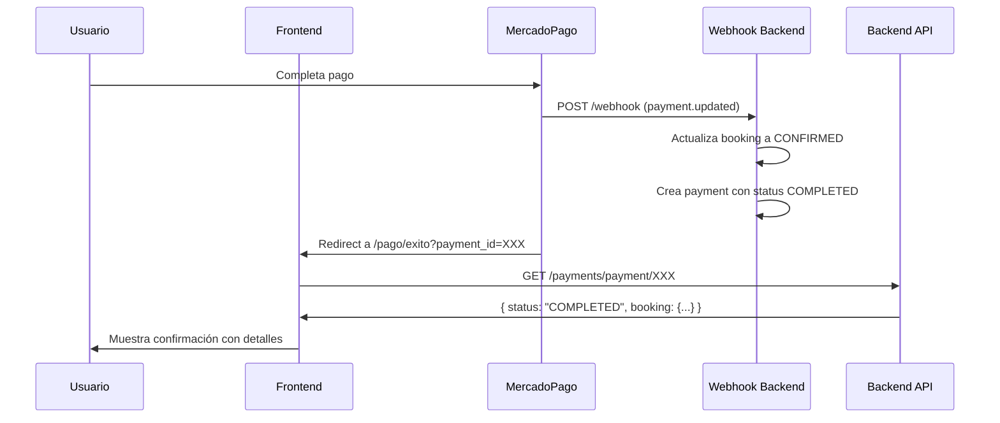

# 🎯 Resumen de Cambios - Páginas de Retorno MP

## ✅ Lo Actualizado

### 1. **Enfoque Simplificado**

Cambiamos de un enfoque de "confirmación desde frontend" a uno más seguro y confiable:

**ANTES ❌:**

- Frontend enviaba todos los parámetros de MP al backend
- Backend procesaba el pago desde el request del frontend
- Riesgo de manipulación de parámetros

**AHORA ✅:**

- Frontend solo consulta el estado del pago con el ID
- Backend ya procesó el pago vía webhook de MP
- Frontend solo muestra el resultado

### 2. **Archivos Modificados**

#### `/src/lib/api/payments.ts`

```typescript
// ✅ Agregado: Interface completa de la respuesta del backend
interface PaymentStatusResponse {
  success: boolean;
  data: {
    id: string;
    status: "PENDING" | "COMPLETED" | "FAILED" | "CANCELLED";
    amount: number;
    // ... todos los campos del pago
    booking: { /* detalles completos */ };
  };
}

// ✅ Actualizado: getPaymentStatus ahora tipado correctamente
async getPaymentStatus(paymentId: string): Promise<PaymentStatusResponse>

// ⚠️  Marcado como deprecated: confirmPayment
// Ya no se usa, pero se mantiene por compatibilidad
```

#### `/src/app/profesionales/[slug]/pago/exito/page.tsx`

```typescript
// ANTES: Extraía 7+ parámetros de la URL
const paymentId = searchParams.get("payment_id");
const collectionId = searchParams.get("collection_id");
const status = searchParams.get("status");
// ... más parámetros

// AHORA: Solo necesita el ID del pago
const paymentId = searchParams.get("payment_id");
const collectionId = searchParams.get("collection_id");
const mpPaymentId = collectionId || paymentId;

// ANTES: Enviaba datos para "confirmar"
await paymentsAPI.confirmPayment({ ...7 parámetros... });

// AHORA: Solo consulta el estado
const response = await paymentsAPI.getPaymentStatus(mpPaymentId);

// ✅ NUEVO: Redireccionamiento inteligente
if (data.status === "COMPLETED") {
  // Muestra página de éxito
} else if (data.status === "PENDING") {
  router.push(`/profesionales/${slug}/pago/pendiente`);
} else if (data.status === "FAILED" || data.status === "CANCELLED") {
  router.push(`/profesionales/${slug}/pago/error`);
}
```

### 3. **Documentación Actualizada**

`IMPLEMENTACION_PAGOS_MP.md` ahora explica:

- ✅ Enfoque basado en consulta, no confirmación
- ✅ El rol crítico del webhook
- ✅ Flujo completo: webhook → consulta → muestra resultado
- ✅ Ventajas de seguridad del nuevo enfoque
- ✅ Configuración del webhook de MP

## 🔄 Flujo Actual



## 🎯 Ventajas del Nuevo Enfoque

| Aspecto             | Antes                           | Ahora                            |
| ------------------- | ------------------------------- | -------------------------------- |
| **Seguridad**       | Confiaba en params del frontend | Solo consulta estado del backend |
| **Confiabilidad**   | Dependía del redirect de MP     | Webhook como fuente primaria     |
| **Simplicidad**     | 7+ parámetros en URL            | Solo 1 ID necesario              |
| **Race conditions** | Problemas si webhook era lento  | No importa el orden              |
| **Validación**      | Frontend validaba parámetros    | Backend es fuente de verdad      |
| **Idempotencia**    | Cuidado con doble confirmación  | Consultar es siempre seguro      |

## 📋 Lo que NO cambió

- ✅ UI de las tres páginas (exito/pendiente/error)
- ✅ Breadcrumbs y navegación
- ✅ Diseño responsive y dark mode
- ✅ Mensajes y UX
- ✅ Estructura de carpetas

## ⚙️ Requisitos del Backend

Para que esto funcione, tu backend DEBE tener:

### 1. Endpoint de Consulta (YA EXISTE) ✅

```
GET /api/payments/payment/{id}
```

Retorna el estado completo del pago según tu schema.

### 2. Webhook de MercadoPago (CRÍTICO) ⚠️

```
POST /api/payments/webhook
```

Este endpoint debe:

- ✅ Recibir notificaciones de MP
- ✅ Verificar el pago con la API de MP
- ✅ Actualizar el booking a CONFIRMED
- ✅ Crear/actualizar el registro de Payment
- ✅ Enviar emails y notificaciones
- ✅ Ser idempotente (no duplicar confirmaciones)

## 🧪 Testing

Para probar el flujo completo:

1. **Usa sandbox de MP**
2. **Configura webhook en MP dashboard** → apunta a tu ngrok/túnel
3. **Crea una preferencia** con las URLs de retorno correctas
4. **Completa un pago de prueba** en MP
5. **Verifica que el webhook llegue** (logs del backend)
6. **Observa el redirect** a `/pago/exito`
7. **Confirma que se muestre** la información correcta

## 🚨 Puntos Críticos

1. **El webhook DEBE estar configurado** - sin él, los pagos no se confirman
2. **El webhook DEBE verificar con MP** - no confiar solo en la notificación
3. **El webhook DEBE ser idempotente** - MP puede enviar duplicados
4. **Las URLs de retorno DEBEN tener el slug** - se configura al crear preferencia
5. **Manejar tanto payment_id como collection_id** - MP puede enviar cualquiera

## 📞 Próximos Pasos

1. ✅ Verifica que el endpoint `/payments/payment/{id}` funcione correctamente
2. ⚠️ Asegúrate que el webhook de MP esté configurado y procesando pagos
3. 🧪 Prueba el flujo completo en sandbox
4. 📧 Verifica que se envíen emails de confirmación desde el webhook
5. 🔔 Confirma que se creen notificaciones para cliente y profesional
6. 🚀 Despliega a producción y configura webhook en MP producción

---

**¡El sistema está listo y es más seguro que antes!** 🎉
